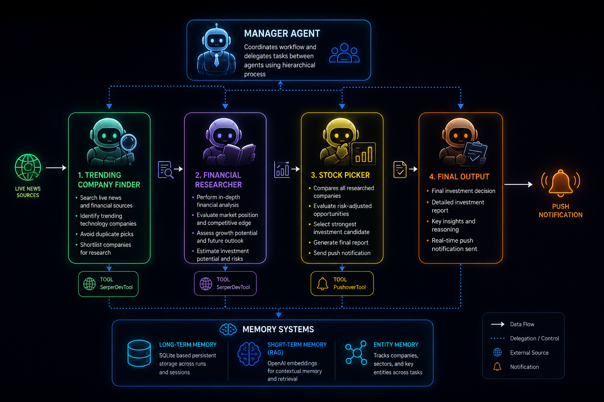
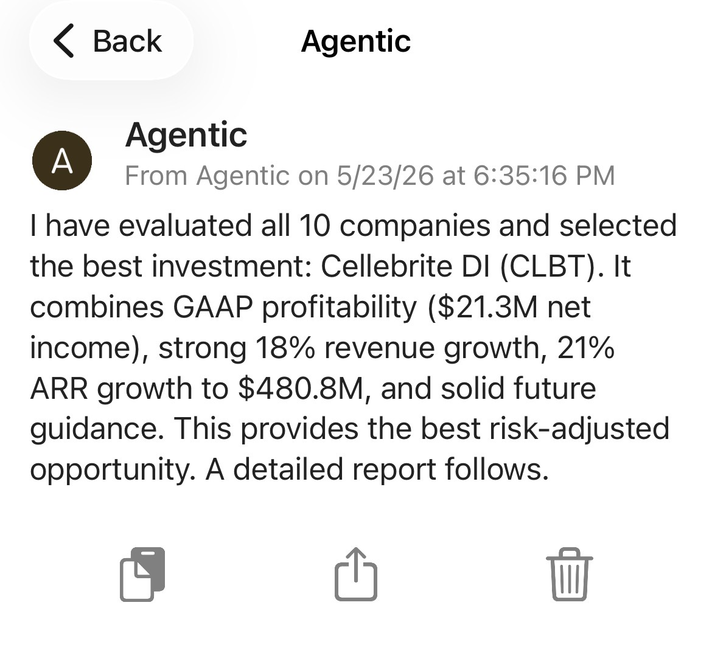

# CrewAI Multi-Agent Stock Picker

An autonomous multi-agent investment research system built using CrewAI, DeepSeek LLMs, OpenAI embeddings, Serper web search, and Pushover notifications.

The system simulates an AI-powered investment research team capable of discovering trending companies, performing financial analysis, comparing investment opportunities, and selecting the strongest stock candidate through hierarchical agent collaboration, delegated reasoning, memory systems, and tool usage.

---

# Project Overview

This project was built to explore how autonomous AI agents can collaborate on complex real-world financial analysis tasks using CrewAI.

Instead of relying on a single monolithic LLM workflow, the system uses multiple specialized AI agents with clearly separated responsibilities and delegated reasoning.

The agents collaboratively:

- Discover trending companies from live financial news
- Perform detailed financial and competitive analysis
- Compare investment opportunities
- Evaluate risk-adjusted returns
- Generate structured investment reports
- Send real-time mobile push notifications
- Persist contextual memory across workflow stages

The workflow behaves like a miniature AI-powered investment research team with:
- hierarchical orchestration
- delegated task execution
- retrieval-based memory
- structured outputs
- external tool usage
- autonomous reasoning loops

---

# Key Features

- Multi-agent CrewAI architecture
- Hierarchical manager delegation workflow
- Autonomous agent collaboration
- Real-time financial/news research
- DeepSeek-powered reasoning agents
- OpenAI embedding-based memory retrieval
- Persistent long-term memory using SQLite
- RAG-powered contextual memory
- Entity tracking across workflow stages
- Custom CrewAI tool integration
- Real-time mobile push notifications using Pushover
- Structured agent outputs using Pydantic
- YAML-based modular agent configuration

---

# Workflow Architecture



---

# Multi-Agent System Design

The project is built around four specialized AI agents coordinated through CrewAI's hierarchical orchestration system.

## 1. Trending Company Finder

Responsible for discovering promising companies from live financial/news trends.

### Responsibilities
- Search latest technology and financial news
- Identify trending companies
- Avoid duplicate company selection
- Pass shortlisted companies to downstream agents

### Tools Used
- SerperDevTool

### LLM
- DeepSeek Chat

---

## 2. Financial Researcher

Performs detailed analysis on each shortlisted company.

### Responsibilities
- Analyze financial metrics
- Evaluate market positioning
- Assess growth outlook
- Estimate investment potential
- Compare strategic advantages

### Tools Used
- SerperDevTool

### LLM
- DeepSeek Chat

---

## 3. Stock Picker

Acts as the final investment decision-maker.

### Responsibilities
- Compare researched companies
- Evaluate risk-adjusted opportunities
- Select strongest investment candidate
- Generate final investment thesis
- Send push notifications to the user

### Tools Used
- Custom Pushover Notification Tool

### LLM
- DeepSeek Chat

---

## 4. Manager Agent

Coordinates the full CrewAI workflow using hierarchical delegation.

### Responsibilities
- Delegate tasks dynamically
- Coordinate inter-agent reasoning
- Manage workflow execution
- Control decision pipeline

### Workflow Type
- Hierarchical Process

---

# Hierarchical Agent Orchestration

The project uses CrewAI hierarchical execution instead of a simple sequential workflow.

This enables the manager agent to dynamically delegate tasks between specialized agents while maintaining coordinated reasoning across the system.

```python
return Crew(
    agents=self.agents,
    tasks=self.tasks,
    process=Process.hierarchical,
    manager_agent=manager,
    memory=True
)
```

This architecture allows:
- autonomous task delegation
- multi-step reasoning
- agent specialization
- workflow coordination
- context-aware collaboration

---

# Persistent Multi-Agent Memory

The system uses multiple CrewAI memory layers to simulate persistent agent reasoning and contextual awareness.

## Long-Term Memory

Uses SQLite-backed persistent storage for retaining information across workflow executions.

```python
long_term_memory = LongTermMemory(
    storage=LTMSQLiteStorage(
        db_path="./memory/long_term_memory_storage.db"
    )
)
```

### Purpose
- Persist investment context across runs
- Store historical workflow information
- Enable future extensibility for recurring analysis

---

## Short-Term RAG Memory

Uses OpenAI embeddings for semantic retrieval-based contextual memory.

```python
short_term_memory = ShortTermMemory(
    storage=RAGStorage(
        embedder_config={
            "provider": "openai",
            "config": {
                "model": "text-embedding-3-small"
            }
        },
        type="short_term",
        path="./memory/"
    )
)
```

### Purpose
- Maintain contextual awareness between agents
- Preserve research findings during workflow execution
- Enable retrieval-augmented reasoning

---

## Entity Memory

Tracks entities such as:
- companies
- stock tickers
- sectors
- research context

This enables the workflow to maintain structured awareness of important entities across multiple reasoning steps.

---

# Structured Agent Communication

The project uses Pydantic models to enforce structured outputs between agents.

```python
class TrendingCompany(BaseModel):
    name: str
    ticker: str
    reason: str
```

### Why This Matters
- Improves reliability of agent communication
- Reduces hallucinated formatting
- Enables typed workflow orchestration
- Creates predictable downstream processing

---

# YAML-Based Agent Configuration

Agent behavior is separated from Python implementation through modular YAML configuration files.

```yaml
financial_researcher:
  role: >
    Senior Financial Researcher

  goal: >
    Given details of trending companies in the news,
    provide comprehensive analysis of each company.
```

### Benefits
- Cleaner system architecture
- Easier experimentation
- Modular workflow design
- Simplified agent tuning
- Better scalability for additional agents

---

# Custom Tool Integration

The project integrates a custom CrewAI tool for real-time mobile notifications using the Pushover API.

```python
class PushNotificationTool(BaseTool):

    def _run(self, message: str) -> str:
        payload = {
            "user": pushover_user,
            "token": pushover_token,
            "message": message
        }

        requests.post(pushover_url, data=payload)
```

### Purpose
- Send real-time AI-generated investment decisions
- Enable autonomous AI-to-user communication
- Demonstrate external API orchestration
- Simulate production-style AI automation workflows

---

# Push Notification Examples

The system sends real-time mobile notifications when the final investment decision is completed.

### Example Notification 1


---

### Example Notification 2



---

# Example Final Investment Decision

The system analyzed 10 trending technology companies and selected:

# Cellebrite DI (CLBT)

## Why It Was Selected

- GAAP profitable
- Strong recurring revenue growth
- High ARR expansion
- Strong future guidance
- Sticky enterprise/government customer base
- Strong risk-adjusted investment profile
- Defensive AI-adjacent market positioning

---

## Companies Compared

The final AI-generated investment analysis compared:

- SoundHound AI
- Rocket Lab
- IonQ
- Innodata
- Rigetti Computing
- C3.ai
- BigBear.ai
- Serve Robotics
- Aehr Test Systems
- Cellebrite DI

The workflow generated:
- comparative investment reasoning
- profitability analysis
- growth comparisons
- future outlook evaluations
- risk-adjusted investment selection

---

# Example CrewAI Execution

The workflow demonstrates:

- delegated reasoning
- agent-to-agent collaboration
- autonomous tool usage
- hierarchical orchestration
- multi-stage research pipelines
- memory-aware execution
- external API integration
- structured decision generation

---

# Tech Stack

## AI / Agent Frameworks
- CrewAI
- CrewAI Tools

## LLMs
- DeepSeek Chat
- OpenAI Embeddings

## Search & Retrieval
- Serper API
- RAG Memory

## Notifications
- Pushover API

## Backend / Infrastructure
- Python
- Pydantic
- SQLite

---

# Project Structure

```text
crewai-stock-picker-agent/
│
├── images/
│   ├── notify1.jpg
│   ├── notify2.jpg
│   └── workflow.png
│
├── output/
│
├── pyproject.toml
├── README.md
│
└── src/
    └── stock_picker/
        ├── __init__.py
        ├── crew.py
        ├── main.py
        │
        ├── config/
        │   ├── agents.yaml
        │   └── tasks.yaml
        │
        └── tools/
            ├── __init__.py
            └── push_tool.py
```

---

# Installation

## 1. Clone Repository

```bash
git clone https://github.com/aditya-ailsinghani/crewai-stock-picker-agent.git
cd crewai-stock-picker-agent
```

---

## 2. Create Virtual Environment

```bash
python3 -m venv .venv
source .venv/bin/activate
```

---

## 3. Install Dependencies

```bash
pip install crewai crewai-tools openai requests
```

---

# Environment Variables

Create a `.env` file in the project root directory.

```env
OPENAI_API_KEY=your_openai_key
SERPER_API_KEY=your_serper_key
PUSHOVER_USER=your_pushover_user
PUSHOVER_TOKEN=your_pushover_token
```

---

# Running the Project

```bash
python src/stock_picker/main.py
```

---

# Future Improvements

- Live stock market data integration
- Portfolio optimization agent
- Risk scoring agent
- Historical backtesting
- Scheduled recurring analysis
- Multi-sector investment analysis
- Streamlit dashboard
- Vector database integration
- Multi-model ensemble reasoning
- Multi-crew orchestration
- Agent evaluation framework

---

# Disclaimer

This project is intended for educational and experimental purposes only and should not be considered financial advice.

---

# Connect

## LinkedIn: https://www.linkedin.com/in/ruchikamotwani20/
## Portfolio: https://ruchika-motwani.notion.site/portfolio
## Email: ruchikamotwani20@utexas.edu
